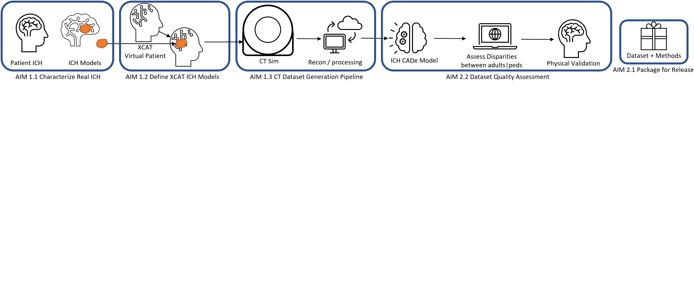
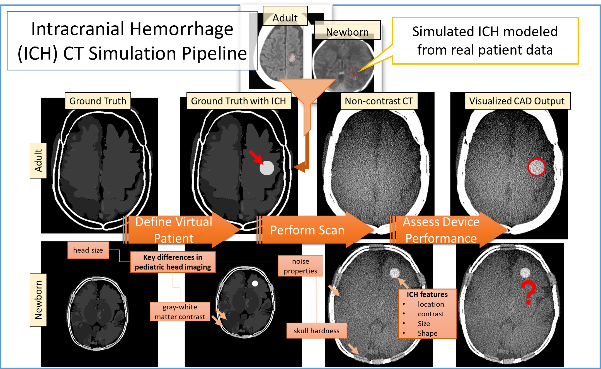

CT Imaging Datasets for Pediatric Device Assessment of Intracranial Hemorrhage
==============================================================================

**Motivation**
Computer aided triaging (CADt) devices for intracranial hemorrhage (ICH) in the emergency room (e.g. `Rapid ICH K221456 <https://www.accessdata.fda.gov/scripts/cdrh/cfdocs/cfpmn/pmn.cfm?ID=K221456>`_) is one important example where pediatric and adult cases exist in a reading queue where pediatric patients could be disadvantaged by being deprioritized for time sensitive treatment using an adult-trained AI model that extrapolates poorly to pediatric patients. While these AI/ML devices have potential to benefit pediatric patients, there is currently a lack of annotated pediatric data for evaluating the balance of risk and benefits.

**Purpose**
To address data availability challenges, we propose to supplement available pediatric patient computed tomography (CT) datasets with data generated in silico, generated using realistic computational human models and physics-based CT simulations. In silico data generation allows for creating examples with true labels with a fraction of the cost that is needed to label real patient data.

Methods
-------

We have previously combined the `pediatric and adult digital XCAT cohort of phantoms <https://aapm.onlinelibrary.wiley.com/doi/10.1118/1.3480985>`_ with the `XCIST x-ray CT simulation framework <https://iopscience.iop.org/article/10.1088/1361-6560/ac9174/meta>`_ to create realistic CT exams. This preliminary work was in support of investigating the `effectiveness of deep learning denoising algorithms in pediatric patients <https://aapm.onlinelibrary.wiley.com/doi/10.1002/mp.16901>`_.
Dr. Elena Sizikova also built a `pipeline for comparative evaluation of digital mammography AI <https://arxiv.org/abs/2310.18494>`_ using in digital models of the breast and digital mammography (DM) acquisition devices, which will serve as a starting point for this aim. Specifically, we will rely on the XCAT phantom as a digital model of the pediatric brain. We will rely on the XCIST simulator to generate CT images. Specifically, we will vary the following parameters:

**Digital model**: patient size, age, contrast b/w grey and white matter, skull hardness, thickness, and ICH morphology, texture, and location

**Imaging Parameters (CT)**: Radiation dose (MA, KV voltage), slice thickness, reconstruction kernels, reconstruction field of view (FoV).

Installation
------------

.. code-block:: bash

        pip install -r notebooks/requirements.txt
        git clone https://github.com/bnel1201/Virtual-Patient-CT-Simulations
        pip install -e ./Virtual-Patient-CT-Simulations

https://github.com/bnel1201/Virtual-Patient-CT-Simulations contains the XCIST simulation code

Tested on python 3.11.3

Layout
------

.. image:: model_layout.png
        :width: 800
        :align: center

The accompanying

Useful Links
------------

- `REALYSM_PedCT: pedsilico-pilot.ipynb <https://github.com/bnel1201/REALYSM_PedCT/blob/PedSilicoICH-Pilot/pedsilico-pilot.ipynb>`_: CT simulation pipeline that we aim to build off of for this project, in particular this notebook was used to make the pilot data images shown in `Methods`)
- `pediatricIQphantoms: running_simulations.ipynb <https://github.com/bnel1201/pediatricIQphantoms/blob/main/examples/running_simulations.ipynb>`_: examples of using a Python wrapper around the `Michigan Image Reconstruction Toolbox (MIRT) <https://github.com/JeffFessler/mirt>`_ for simple, faster CT simulations
